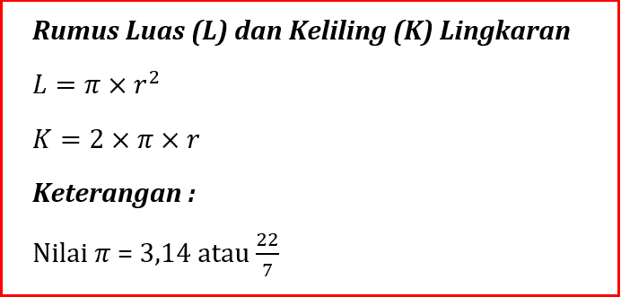
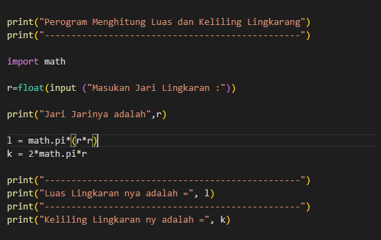
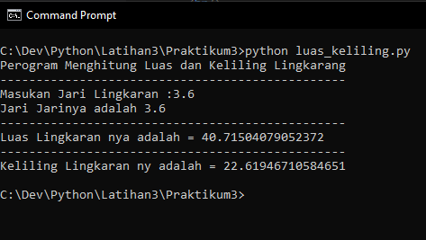

# Praktikum3
## Program Menghitung Luas dan Keliling Lingkaran
Perogram ini dibuat untuk menghitung luas dan keliling lingkaran  
Program menggunakan rumus luas dan keliling lingkaran yang dimasukan ke dalam program python 
Rumus luas lingkaran L=π*r*r  
Rumus Keliling lingkaran K=2π*r  
 

Berikut Untuk Foluwchart Program Hitung luas dan Keliling lingkaran 
 

Disini saya menggunakan [Modul Math](https://www.w3schools.com/python/python_math.asp)
 yang sudah di sediakan oleh python. Fungsinya supaya saya dapat menyertakan nilai phi yang sudah tersedia dalam modul tersebut dengan perintah math.pi jika kita coba mencetak fungsi tersebut maka akan menghasilkan nilai 3.14 
 

Dan ini untuk hasil perogram nya jika di jalankan pada CMD

 

 

